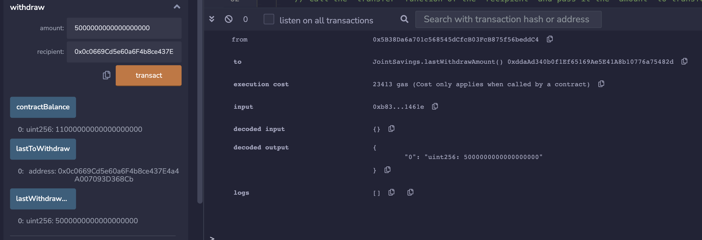

# SMART CONTRACTS FOR JOINT SAVINGS ACCOUNTS

This repo contains a Solidity smart contract that automates the process of hosting joint savings accounts.  

To create this automation, the smart contract accepts two user addresses that are able to control a joint savings account. The smart contract uses ether management functions to implement a financial institution’s requirements for providing the features of the joint savings account, including the ability to deposit and withdraw funds from the account.

---
## Technologies

This application leverages Solidity version 0.5.0.

---
## Installation Guide

* Begin by cloning the GitHub repo (the same repo that this README.md file is contained within) into your terminal. 

* Next, in your web browser go to the [Remix IDE](https://remix.ethereum.org/).

* In the file section, navigate to the cloned repo and open the __join_savings.sol__ Solidity smart contract.

---
## Running the Solidity Smart Contract

* While in Remix, navigate to the "Compile" secion and first compile the smart contract.

* Next navigate to the "Deploy" section and deploy the smart contract.

* In the sidebar on the left towards the bottom, you will see the name of the smart contract. Click on the arrow next to it, which will display a number of buttons corresponding to the contract's functions.

* Navigate this user inferface to make various transactions, inlcuding setting the joint account adddresses, making deposits, withdraws, and checking the balance.

---
## Execution Results

This section contains a number of transaction examples. Similar results can be expected when making deposits and withdraws accordingly.

The first example is a deposit of 1 ETH. Note how upon clickng the 'contractBalance' button, the updated balance is displayed:

The second example is a deposit of 10 ETH. Note how upon clickng the 'contractBalance' button, the updated balance is displayed:

The third example is a deposit of 5 ETH. Note how upon clickng the 'contractBalance' button, the updated balance is displayed:

The next example is a withdraw of 5 ETH. Note how upon clickng the 'contractBalance' button, the updated balance is displayed:

This following example pertains to the withdraw of 5 ETH. This is a screenshot of what to expect in the terminal output that displays confirmation of the process:

The next example is a withdraw of 10 ETH. Note how upon clickng the 'contractBalance' button, the updated balance is displayed:

This following example pertains to the withdraw of 10 ETH. This is a screenshot of what to expect in the terminal output that displays confirmation of the process:

---
## Contributors

Nicole Roberts,
elle.nicole.roberts@gmail.com

---
## License

[BSD 3](https://choosealicense.com/licenses/bsd-3-clause-clear/): BSD 3-clause is a permissive licence, allowing nearly unlimited freedom with the software as long as BSD copyright and license notice is included.